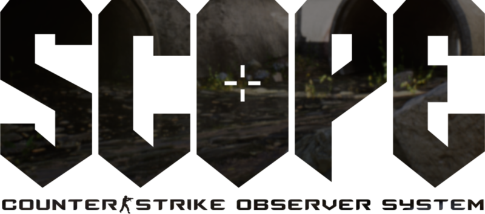

The SCOPE CS:GO Observer System has been designed from the ground up to give any individual the tools to observe with the modern standards of todays E-sports world. Major TOs such as ESL, FPL, and Blast not only have multiple observers for their events; but also have software that modifies the game itself, as well as custom designed HUDs that directly sync in with their overall broadcast package.

The typical observer at a local LAN or online event will not have access to these vast resources, so SCOPE tries to bring as much of that production value to the vanilla game as possible. One person is now able to switch between first person player views and overhead shots of the map on the fly, and easily trigger cinematic flyover cameras around the map for when the action on the server comes to a pause.

All of these camera views are grouped in an intuitive way that is identical across the entire map pool, so once you know one map, you know them all. Installation (and uninstallation) is simple, and executing the config only requires a single command.

Thanks for looking through the SCOPE, happy observing!

## Set Up
Download **aoys_scope.zip** and extract the contents into your game directory's `/csgo/cfg` folder.

After extracting, copy the contents from within the **cameras** folder, and paste them into your game directory's `/csgo/maps` folder. Be sure to replace any existing files.

___
Ensure the following bind is in your **autoexec.cfg**:

    bind "`" "toggleconsole";
    
IF THIS LINE IS NOT INCLUDED YOU CAN LOSE ACCESS TO THE CS:GO CONSOLE.
It is highly recommended to set **ALL** of your in-game keybinds and settings in your **autoexec.cfg**.
___

To uninstall, remove the two directories and two files within **/csgo/cfg** that begin with `aoys_`, then verify the game installation from within Steam.

## Getting Started
After loading into the game server or demo you are going to be observing, open the console and enter the following command using the common name of the map you are on, for example:

    exec aoys_scope/inferno

## Key Mappings

### Toggles
There are a few toggle keybinds set by SCOPE that are not shown the the console reference in game. Most importantly the command to open the console has moved to the **backslash** key to prevent accidentally opening the console during a broadcast.

` \ `  - Open Console

` Z `  - Switch to Free Cam

` X `  - Toggle X-ray Mode

` C `  - Crosshair Display (static/player)

` V `  - Grenade Cam (hold)

` H `  - Toggle HUD

### Player Cams
The keybinds are grouped by when these camera views are typically happening during a broadcast. The number keys are assigned to each player in the game's **Player Cam**, and the row underneath is for assigning those players to their respective team's **Star Player** slot.

`` ` `` - Team 1 - Star Player

` 1 ` - Team 1 - Player 1 - Assign ` Q `

` 2 ` - Team 1 - Player 2 - Assign ` W `

` 3 ` - Team 1 - Player 3 - Assign ` E `

` 4 ` - Team 1 - Player 4 - Assign ` R `

` 5 ` - Team 1 - Player 5 - Assign ` T `

` 6 ` - Team 2 - Player 1 - Assign ` Y `

` 7 ` - Team 2 - Player 2 - Assign ` U `

` 8 ` - Team 2 - Player 3 - Assign ` I `

` 9 ` - Team 2 - Player 4 - Assign ` O `

` 0 ` - Team 2 - Player 5 - Assign ` P `

` - `  - Team 2 - Star Player

For example, to assign *Player 3* from *Team 2* to the **Star Player** slot, press ` I `.

For hectic trading situations, the `spacebar` will quickly switch to the next living player. This can also be useful in 1v1 situations to quickly switch between the two remaining players.

Holding `shift` while pressing any of the **Player Cams** will move to the nearest **Action Cam** to that player.

### Action Cams
The Function Keys are assigned to **Action Cams**, grouped by areas on the map. These are nearly static overviews of key areas used to display team formations or various strategy around the map. Player X-rays are shown on all of these cameras.

` F1  ` - A Site

` F2  ` - A Main

` F3  ` - A Short

` F4  ` - A Long

` F5  ` - B Site

` F6  ` - B Main

` F7  ` - B Short

` F8  ` - B Long

` F9  ` - Middle

` F10 ` - Alt Middle

` F11 ` - Middle to CT

` F12 ` - Middle to T

### Spawn Cams
These are the only cameras expected to be used in a specific order during a broadcast. The **Spawn Cams** are grouped by which team is to be viewed. These cameras are best utilized in-between rounds, and at the very beginning of a round. The order is set as **Spawn Cams** > **Exit Cam 1** > **Exit Cam 2**. The player X-rays will be hidden for the spawn cams, and shown for the exit cams.

`ins ` - CT Spawn Cams

`home` - CT Exit Cam 1

`pgup` - CT Exit Cam 2

`del ` - T Spawn Cams

`end ` - T Exit Cam 1

`pgdn` - T Exit Cam 2

### Cinematic Cams
These cameras are expected to be used at the end of rounds (during a save, or when the bomb is about to detonate and players are evacuating the site) and during timeouts. These binds are grouped horizontally across the Numpad. The player X-rays will be hidden for these cameras.

`num` - A Site Overviews

` / ` - A Site Short

` * ` - A Site Long

` - ` - A Site AWP Hold

` 7 ` - B Site Overviews

` 8 ` - B Site Short

` 9 ` - B Site Long

` + ` - B Site AWP Hold

` 4 ` - Middle Overview

` 5 ` - Middle to A

` 6 ` - Middle to B

` 1 ` - Gameplay Point 1

` 2 ` - Gameplay Point 2

` 3 ` - Gameplay Point 3

` 0 ` - Map Landmark 1

` . ` - Map Landmark  2

`ent` - Map Landmark  3

### Console Output
A visual representation of all of the camera keybinds used by SCOPE will appear in your console after running the command. If it appears as a jumbled mess of lines and characters, resize the console window to be larger and the display will appear as shown:

       T1-Star      T1-P1       T1-P2       T1-P3       T1-P4       T1-P5     |     T3-P1       T2-P2       T2-P3       T2-P4       T2-P5      T2-Star   
      ---------   ---------   ---------   ---------   ---------   ---------   |   ---------   ---------   ---------   ---------   ---------   ---------  
     |         | |         | |         | |         | |         | |         |  |  |         | |         | |         | |         | |         | |         | 
     |    `    | |    1    | |    2    | |    3    | |    4    | |    5    |  |  |    6    | |    7    | |    8    | |    9    | |    0    | |    -    | 
     |         | |         | |         | |         | |         | |         |  |  |         | |         | |         | |         | |         | |         | 
      ---------   ---------   ---------   ---------   ---------   ---------   |   ---------   ---------   ---------   ---------   ---------   ---------  
          ^         ---------   ---------   ---------   ---------   ---------  \    ---------   ---------   ---------   ---------   ---------      ^     
         / \       |         | |         | |         | |         | |         |  |  |         | |         | |         | |         | |         |    / \    
          |        |    Q    | |    W    | |    E    | |    R    | |    T    |  |  |    Y    | |    U    | |    I    | |    O    | |    P    |     |     
          |_____   |         | |         | |         | |         | |         |  |  |         | |         | |         | |         | |         | ____|     
                    ---------   ---------   ---------   ---------   ---------   |   ---------   ---------   ---------   ---------   ---------            
                                     Team 1 - Set Star Player                   |                    Team 2 - Set Star Player            

                               ACTION CAMS                             |                             CINEMATIC CAMS                                      
               --------------------------------------------------      |      --------------------------------------------------------------             
              |                |                |                |     |     |                |              |              |               |            
              |                |                |                |     |     |                |              |              |               |            
              |   CT Overview  |    CT Exit 1   |    CT Exit 2   |     |     |   A Overview   |    A Long    |    A Short   |   AWP Hold A  |            
              |      (ins)     |     (home)     |     (pgup)     |     |     |    (numlock)   |     (/)      |     (*)      |      (-)      |            
              |                |                |                |     |     |                |              |              |               |            
              |                |                |                |     |     |                |              |              |               |            
               --------------------------------------------------      |      ----------------------------------------------|---------------             
              |                |                |                |     |     |                |              |              |               |            
              |                |                |                |     |     |                |              |              |               |            
              |   T Overview   |    T Exit 1    |    T Exit 2    |     |     |   B Overview   |    B Long    |    B Short   |   AWP Hold B  |            
              |      (del)     |      (end)     |     (pgdn)     |     |     |       (7)      |     (8)      |     (9)      |      (+)      |            
              |                |                |                |     |     |                |              |              |               |            
              |                |                |                |     |     |                |              |              |               |            
               --------------------------------------------------      |      ==============================================                |            
                                                                       |     |                |              |              ║               |            
               ---------   ---------   ---------   ---------           |     |                |              |              ║               |            
              |         | |         | |         | |         |          |     |  Mid Overview  |    Mid > A   |    Mid > B   ║               |            
              |   F1    | |   F2    | |   F3    | |   F4    |          |     |       (4)      |     (5)      |     (6)      ║               |            
              |         | |         | |         | |         |          |     |                |              |              ║               |            
               ---------   ---------   ---------   ---------           |     |                |              |              ║               |            
                A Over      A Main      A Short      A Long            |      --------------------------------------------- ║ ==============             
                                                                       |     |                |              |              ║               |            
               ---------   ---------   ---------   ---------           |     |                |              |              ║               |            
              |         | |         | |         | |         |          |     |  Chokepoint 1  | Chokepoint 2 | Chokepoint 3 ║               |            
              |   F5    | |   F6    | |   F7    | |   F8    |          |     |       (1)      |     (2)      |     (3)      ║               |            
              |         | |         | |         | |         |          |     |                |              |              ║               |            
               ---------   ---------   ---------   ---------           |     |                |              |              ║               |            
                B Over      B Main      B Short      B Long            |      ==============================================                |            
                                                                       |     |                               |              |               |            
               ---------   ---------   ---------   ---------           |     |                               |              |               |            
              |         | |         | |         | |         |          |     |           Landmark 1          |  Landmark 2  |   Landmark 3  |            
              |   F9    | |   F10   | |   F11   | |   F12   |          |     |              (0)              |      (.)     |    (enter)    |            
              |         | |         | |         | |         |          |     |                               |              |               |            
               ---------   ---------   ---------   ---------           |     |                               |              |               |            
                  Mid       Alt Mid     Mid > CT    Mid > T            |      --------------------------------------------------------------            

    
## Return To Gameplay

To remove all of the configuration changes made by SCOPE and return to your personal **autoexec.cfg** configuration, enter this command in the console:

    exec aoys_scope/exit

## Notes

This system is designed to require no additional configuration beyond the initial installation, and be a fully 'in-the-box' solution for observing CS:GO. As long as you have a fully configured **autoexec.cfg** with all of your personal settings, switching in and out of SCOPE should be as entering the commands listed above.

Feel free to drop by my stream on Twitch any time you see me live if you have any questions, or just want to say hello!

[https://twitch.tv/ALEXonyourscreen](https://twitch.tv/ALEXonyourscreen)

